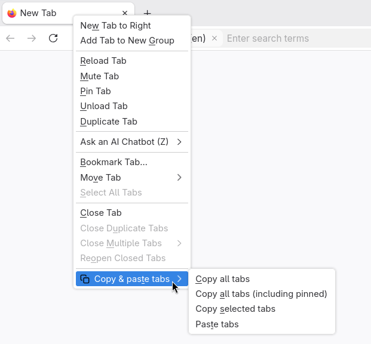

<!--
Copyright 2026 Stanislav Senotrusov

This work is dual-licensed under the Apache License, Version 2.0
and the MIT License. Refer to the LICENSE file in the top-level directory
for the full license terms.

SPDX-License-Identifier: Apache-2.0 OR MIT
-->

# Copy and Paste Tabs

A lightweight Firefox extension that allows you to easily copy open tabs in your current window or across all windows to your clipboard, and paste a list of URLs from your clipboard to open them simultaneously.



## Features

Right-click on any tab in your browser to access the extension's submenu, which contains the following actions:

- **Copy tabs**: Copies a list of all *unpinned* tabs in the active window.
- **Copy tabs (including pinned)**: Copies a list of *all* tabs in the active window, including the pinned ones.
- **Copy selected tabs**: Copies a list of all currently highlighted (selected) tabs in the active window, regardless of whether they are pinned.
- **Copy tabs from all windows**: Copies a list of all *unpinned* tabs across all open browser windows.
- **Copy tabs from all windows (including pinned)**: Copies a list of *every* open tab across all windows, including the pinned ones.
- **Paste tabs**: Extracts all valid `http://`, `https://`, and `file://` URLs from your current clipboard text and instantly opens them as new tabs in the background.

### Copy Format

When copying tabs to your clipboard, the extension outputs plain text formatted like this:

```text
{tab title}
{tab url}

{tab title}
{tab url}

```

### Smart Filtering

- **Protocol Filtering:** The extension ignores browser-internal pages (like `about:config` or `about:addons`) and extension pages. It only copies standard web links (`http`/`https`) and local files (`file`). The same filter is applied when pasting.
- **Missing Titles:** If a tab happens to be missing a title, the extension will omit the empty title line and output just the URL.

## License

This work is dual-licensed under the Apache License, Version 2.0
and the MIT License. Refer to the [LICENSE](LICENSE) file in the top-level
directory for the full license terms.

## Get involved

See the [CONTRIBUTING](CONTRIBUTING.md) file for guidelines
on how to contribute, and the [CONTRIBUTORS](CONTRIBUTORS.md)
file for a list of contributors.
