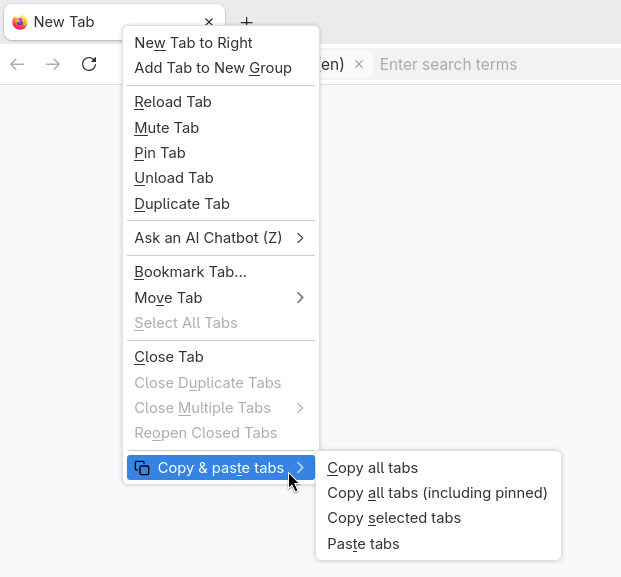

<!--
Copyright 2026 Stanislav Senotrusov

This work is dual-licensed under the Apache License, Version 2.0
and the MIT License. Refer to the LICENSE file in the top-level directory
for the full license terms.

SPDX-License-Identifier: Apache-2.0 OR MIT
-->

# Copy and Paste Tabs

A lightweight Firefox extension that allows you to easily copy open tabs in your current window or across all windows to your clipboard, and paste a list of URLs from your clipboard to open them simultaneously.



## Features

Right-click on any tab in your browser to access the extension submenu:

- **Copy unpinned**: Copies a list of all unpinned tabs in the active window.
- **Copy all**: Copies a list of every tab in the active window, including those that are pinned.
- **Copy selected**: Copies a list of all currently selected tabs.
- **Copy unpinned from all windows**: Copies unpinned tabs across every open browser window, grouped by window headers.
- **Copy all from all windows**: Copies every open tab across all windows, grouped by window headers.
- **Paste into one window**: Extracts URLs from the clipboard and opens them as new tabs in the current window.
- **Paste into multiple windows**: Reconstructs window structures by opening URLs in new windows whenever a window divider is detected in the clipboard text.

### Copy Format

When copying tabs, the extension outputs plain text formatted with Markdown compatibility. For multi-window copies, it generates headers based on the top three most frequent domains in each window.

```text
## wikipedia.org, openstreetmap.org, stackoverflow.com...

{tab title}  
{tab url}

{tab title}  
{tab url}

## gutenberg.org, archive.org

{tab title}  
{tab url}
```

- **Markdown Line Breaks:** Each title is followed by two trailing spaces to ensure proper line breaks when rendered in Markdown viewers.
- **Missing Titles:** If a tab has no title, the extension omits the title line and provides only the URL.

### Smart Paste Logic

The **Paste into multiple windows** feature uses intelligent window allocation:
- **Blank Window Detection:** If your current window is "blank" (e.g., only showing the New Tab page), the first batch of URLs will open in the current window instead of spawning a new one.
- **Multi-Format Divider Support:** The extension recognizes window boundaries from various markup languages, allowing you to paste lists stored in different document types:
    - **Markdown / AsciiDoc / Org-mode / Textile**: ATX-style headers (e.g., `##`, `==`, `**`, `h2.`).
    - **MediaWiki**: Symmetrical headers (e.g., `==Heading==`).
    - **LaTeX**: Semantic commands (e.g., `\subsection{`).
    - **Setext-style**: Underlines or adornments (e.g., `---`, `===`, `~~~`) used in Markdown, reStructuredText, or AsciiDoc.

### Protocol Filtering

The extension ignores browser-internal pages (like `about:config`) and extension pages. It only processes standard web links (`http`/`https`) and local files (`file`).

## Privacy

**No data collection:** This extension only interacts with your tabs and clipboard when you explicitly trigger an action from the tab context menu. It does not access the network and processes all URLs and text locally on your device.

## License

This work is dual-licensed under the Apache License, Version 2.0
and the MIT License. Refer to the [LICENSE](LICENSE) file in the top-level
directory for the full license terms.

## Get involved

See the [CONTRIBUTING](CONTRIBUTING.md) file for guidelines
on how to contribute, and the [CONTRIBUTORS](CONTRIBUTORS.md)
file for a list of contributors.
