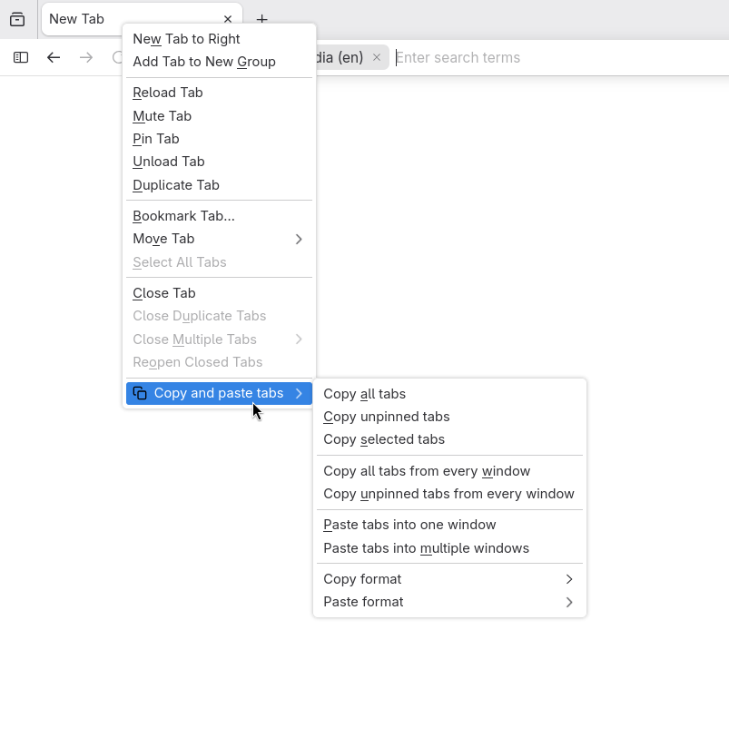
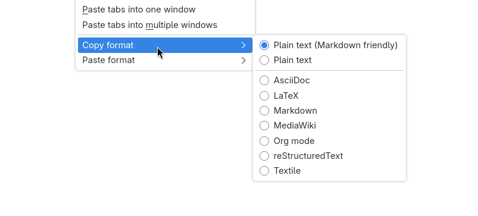
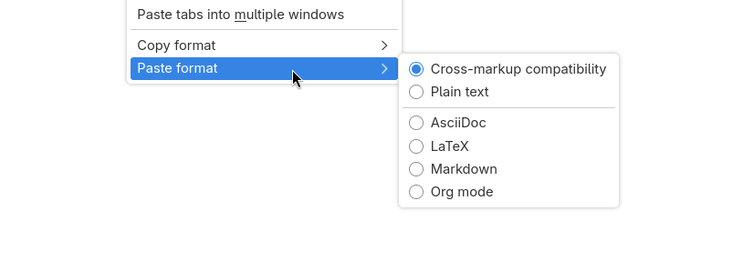

<!--
Copyright 2026 Stanislav Senotrusov

This work is dual-licensed under the Apache License, Version 2.0
and the MIT License. Refer to the LICENSE file in the top-level directory
for the full license terms.

SPDX-License-Identifier: Apache-2.0 OR MIT
-->

# Copy and Paste Tabs

A lightweight Firefox extension that allows you to easily copy open tabs in your current window or across all windows to your clipboard, and paste a list of URLs from your clipboard to open them simultaneously.

## Features

Right-click on any tab in your browser to access the **Copy and paste tabs** submenu:

- **Copy all tabs**: Copies every tab in the active window, including those that are pinned.
- **Copy unpinned tabs**: Copies a list of all unpinned tabs in the active window.
- **Copy selected tabs**: Copies a list of all currently selected tabs.
- **Copy all tabs from every window**: Copies every open tab across all browser windows, grouped by window headers.
- **Copy unpinned tabs from every window**: Copies unpinned tabs across every browser window, grouped by window headers.
- **Paste tabs into one window**: Extracts URLs from the clipboard and opens them as new tabs in the current window.
- **Paste tabs into multiple windows**: Reconstructs window structures by opening URLs in new windows whenever a window divider is detected in the clipboard text.

### Copy format selection

You can choose your preferred format from the **Copy format** submenu. The selected format is saved and used for all future copy operations.

Supported formats:

- **Plain text (Markdown friendly)** (Default): `Title` followed by two spaces and `url` on the next line (forces a line break in Markdown viewers).
- **Plain text**: `Title` followed by `url` on the next line (no trailing spaces).
- **AsciiDoc**: `url[Title]`
- **LaTeX**: `\href{url}{Title}`
- **Markdown**: `[Title](url)`
- **MediaWiki**: `[url Title]`
- **Org mode**: `[[url][Title]]`
- **reStructuredText**: `` `Title <url>`__ ``
- **Textile**: `"Title":url`

When copying from multiple windows, the extension generates subsection headers (`##` or an equivalent) using titles based on the three most frequent domains in each window.

### Paste format selection

The **Paste format** submenu allows you to configure how the extension extracts URLs from your clipboard.

Supported paste formats:

- **Cross-markup compatibility** (Default): A versatile strategy designed to work with most mainstream formats.
- **Plain text**: A strict extractor that captures sequences starting with supported protocols until it encounters whitespace or quote characters.
- **AsciiDoc**: Specifically handles URLs within AsciiDoc's inline macros and passthrough blocks.
- **LaTeX**: Extracts URLs from within LaTeX commands like `\href`.
- **Markdown**: Handles the various nuances of Markdown link syntax, including angle brackets and balanced parentheses.
- **Org mode**: Designed to extract and unescape URLs from Org mode link structures.

If a format exists in the **Copy format** menu (such as MediaWiki, reStructuredText, or Textile) but does not have a dedicated entry in the **Paste format** menu, use the **Cross-markup compatibility** option to ensure accurate conversion.

If you are pasting a list that was originally copied using this extension, every supported format includes logic to encode special characters. Because of this, the URLs will be recognized correctly during paste operations regardless of which paste format option is currently selected.

The paste format options are primarily useful when pasting from external sources, such as user documents. The **Cross-markup compatibility** option is designed to work with most formats, but it will stop at markup delimiters like `[`, `}`, `)`, or `]` that may be present in valid URLs. If you are dealing with external sources where URLs contain these characters, selecting the appropriate specific format (e.g., "Markdown") will ensure higher accuracy.

Conversely, the **Plain text** option will never stop on characters outside of the valid URL character set. However, if you use this option with markup documents, parts of the closing markup syntax may be incorrectly included in the extracted URL.

Overall, if you are only pasting text that you previously copied using this extension, **Cross-markup compatibility** is the best option because it works without surprises across all available copy formats.

### Smart paste logic

The **Paste into multiple windows** feature uses intelligent window allocation:

- **Blank Window Detection:** If your current window is "blank" (e.g., only showing the New Tab page), the first batch of URLs will open in the current window instead of spawning a new one.
- **Multi-Format Divider Support:** The extension recognizes window boundaries from various markup languages, allowing you to paste lists stored in different document types:
  - **Markdown / AsciiDoc / Org mode / Textile**: ATX-style headers (e.g., `##`, `==`, `**`, `h2.`).
  - **MediaWiki**: Symmetrical headers (e.g., `==Heading==`).
  - **LaTeX**: Semantic commands (e.g., `\subsection{`).
  - **Setext-style**: Underlines or adornments (e.g., `---`, `===`, `~~~`) used in Markdown, reStructuredText, or AsciiDoc.

### Protocol filtering

The extension ignores browser-internal pages (like `about:config`) and extension pages. It only processes standard web links (`http`/`https`) and local files (`file`).

## Privacy

**No data collection:** This extension only interacts with your tabs, clipboard, and local storage (to save formatting preferences) when you explicitly trigger an action from the tab context menu. It does not access the network and processes all URLs and text locally on your device.

## License

This work is dual-licensed under the Apache License, Version 2.0
and the MIT License. Refer to the [LICENSE](LICENSE) file in the top-level
directory for the full license terms.

## Get involved

See the [CONTRIBUTING](CONTRIBUTING.md) file for guidelines
on how to contribute, and the [CONTRIBUTORS](CONTRIBUTORS.md)
file for a list of contributors.
